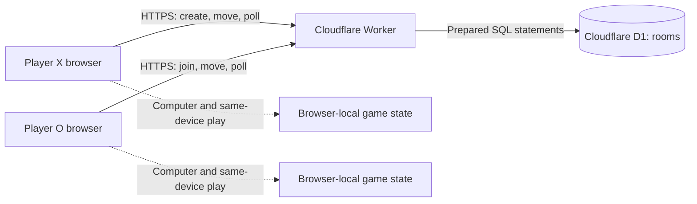

# Play Together

A browser game room for **rock-paper-scissors and tic-tac-toe**. Share one link with your brother and switch between games inside the same room. Both games also support a computer opponent and two players on the same device.

**Play:** [tic-tac-toe-together.sanjaykolapkar02.workers.dev](https://tic-tac-toe-together.sanjaykolapkar02.workers.dev/)

## Interface

The interface uses a centered dark arena with game tabs, a sliding mode selector, compact room controls, match scores, and large hand cards. Buttons respond to hover and presses, hand choices animate into view, winning cards are highlighted, and score changes use animated counters. Controls and cards scale down on phones. Keyboard focus is visible throughout.

The button, fade, counting-number, and visibility-hook sources in `components/animate-ui/` come from [Animate UI](https://github.com/imskyleen/animate-ui), with local adaptations for native buttons, server rendering, and reduced motion. The upstream license is retained in `components/animate-ui/LICENSE.md`. Motion provides the animation runtime; game and mode indicators use shared layout animations. Reduced-motion preferences disable transforms and score animations.

[Lenis](https://github.com/darkroomengineering/lenis) adds smooth desktop wheel scrolling. Touch devices keep native scrolling, and reduced-motion preferences disable smoothing and interface animations, including when the preference changes while the page is open. `components/smooth-scroll.tsx` creates and cleans up the scrolling instance.

Room synchronization currently uses the HTTP protocol described below. Replacing periodic room reads with WebSocket updates is the next system-design stage; this interface update keeps the current protocol.

## Product specification

| Mode | Players | State | How it works |
| --- | --- | --- | --- |
| Online | Two browsers | Cloudflare D1 | Share a room; take turns in tic-tac-toe or lock hidden choices in rock-paper-scissors. |
| Computer | One browser | Browser memory | Play against minimax in tic-tac-toe or random hands in rock-paper-scissors. |
| Same device | Two people on one browser | Browser memory | Alternate board moves or pass the device after a hidden hand choice. |

## Play with your brother

1. Open the live link and choose **Rock-paper-scissors** or **Tic-tac-toe**.
2. Keep **Online** selected, press **Create a room**, and copy the invite link.
3. Your brother opens that link on his browser and presses **Join this room**.
4. In rock-paper-scissors, each player chooses a hand independently. Choices lock immediately and both hands appear only after both players have chosen. The server hides the opponent's hand in API responses as well as in the UI.
5. After a round, both players press **Play again**. Scores continue across rounds.
6. To change games, select the other game above the card. Your brother confirms with **Switch game**. The room URL and seats stay the same; the new game starts at round 1 with fresh scores. Either player can cancel or decline a pending switch.

Rock beats scissors, scissors beat paper, and paper beats rock. Identical choices are a tie. The homepage defaults to rock-paper-scissors; `/?game=ttt` opens the tic-tac-toe lobby. Existing room links continue to open their saved game, including rooms created before this update. A room cannot change games until both players have joined.

In online mode, the creator gets Player 1 (X) and the first other browser to join gets Player 2 (O). A third browser cannot take a seat. The room creator shares the `?room=<id>` URL; the invitee joins from that URL. A returning player keeps the same seat while the browser retains its player cookie. Both players must press **Play again** after a finished round. Scores continue across rounds. In tic-tac-toe, the starting mark alternates between X and O; in computer mode, the human starts each new round as X. Local modes reset on refresh. Switching games in a local mode starts a fresh match immediately.

Tic-tac-toe uses a 3×3 board. A player wins with three marks in any row, column, or diagonal. A full board without a winning line is a tie. Each finished round of either game increments the appropriate X, O, or tie score once. A room can be opened for seven days after creation. The URL alone identifies a room; each player's browser cookie identifies their seat.

## Architecture



The UI is a React client in `components/game-screen.tsx`, initialized from URL parameters by `app/page.tsx`, and built with Next.js through Vinext for Cloudflare Workers. It calls the room API at `app/api/rooms/route.ts`. The route handles HTTP, the player cookie, and error responses. `db/rooms.ts` owns room persistence, seat checks, hidden choices, and mutual game switching. `lib/game.ts` owns tic-tac-toe rules and minimax. `lib/arena.ts` owns the shared game types and rock-paper-scissors rules, scoring, and round reset. Online game state is authoritative in D1; the browser renders the latest server response. The computer and same-device modes use React state and do not call the room API.

When an online room is open, each browser sends a `GET` about once per second. The client accepts a response only if its room version is at least as new as the version already displayed. If polling fails, the UI shows **Reconnecting** and pauses moves until it receives a fresh response. Each fetch has a 12-second timeout.

### Source map

| Path | Responsibility |
| --- | --- |
| `app/page.tsx`, `components/game-screen.tsx`, and `app/globals.css` | URL initialization, game screen, room flows, local modes, and styles. |
| `components/smooth-scroll.tsx` | Lenis desktop scrolling with touch and reduced-motion handling. |
| `components/animate-ui/` | Adapted Animate UI primitives, visibility hook, and upstream license. |
| `app/api/rooms/route.ts` | `GET` and `POST` HTTP interface, cookie handling, and response status. |
| `lib/game.ts` | Pure game rules, outcomes, scoring, round reset, and minimax computer opponent. |
| `lib/arena.ts` | Game selection, shared state types, RPS outcomes, locked choices, and rematches. |
| `db/rooms.ts` | D1 queries, player seats, expiry checks, and versioned updates. |
| `db/schema.ts` and `drizzle/` | Room schema and its checked-in SQL migration. |
| `cloudflare-deploy.json` | Worker name and existing D1 binding details. |
| `scripts/prepare-cloudflare-deploy.mjs` | Applies those details to the generated Wrangler config after a build. |
| `tests/multiplayer.test.mjs` | Both games: API checks for seats, privacy, scoring, rematches, concurrent choices, and switches. |

The remaining `build/`, `scripts/`, and component files support the Vinext and Cloudflare build environment. Generated `dist/`, `node_modules/`, and local Wrangler state are excluded from Git.

## Online protocol

All online requests use `/api/rooms`. Responses are JSON and include `Cache-Control: no-store`. A successful room response has this shape:

```json
{
  "id": "0123456789abcdef0123456789abcdef",
  "version": 3,
  "role": "X",
  "joined": true,
  "game": {
    "kind": "ttt",
    "board": ["X", null, null, null, "O", null, null, null, null],
    "turn": "X",
    "round": 1,
    "scores": { "X": 0, "O": 0, "ties": 0 },
    "ready": []
  }
}
```

| Request | Purpose | Relevant body or query |
| --- | --- | --- |
| `POST /api/rooms` | Create room; creator receives X. | `{ "action": "create", "kind": "rps" }` (`ttt` is the API default for older clients). |
| `POST /api/rooms` | Claim O or return the existing seat. | `{ "action": "join", "id": "<room-id>" }` |
| `GET /api/rooms?id=<room-id>` | Read the current room for an existing player. | Player cookie required. |
| `POST /api/rooms` | Place a mark at a zero-based board index. | `{ "action": "move", "id": "<room-id>", "index": 4, "version": 3 }` |
| `POST /api/rooms` | Mark a player ready for the next round. | `{ "action": "ready", "id": "<room-id>", "version": 4 }` |
| `POST /api/rooms` | Lock a rock-paper-scissors hand. | `{ "action": "choose", "id": "<room-id>", "choice": "rock", "version": 3 }` |
| `POST /api/rooms` | Request or confirm a game switch. | `{ "action": "switch", "id": "<room-id>", "kind": "ttt", "version": 4 }` |

For a rock-paper-scissors room, `game` contains `kind: "rps"`, `round`, `scores`, `ready`, `picks: { X, O }`, `submitted: { X, O }`, and `startedAtVersion`. Until both players submit, the opponent's `picks` value is always `null`; `submitted` reveals only whether a hand has been locked. Once both submit, both hands are returned. A pending game switch adds `pendingSwitch: { kind, ready }` to either game's state. Sending `switch` with the current game kind cancels that request. Switching resets scores and round state, retains seats and expiry, and requires no schema migration.

`move`, `ready`, and `switch` include the version the browser last saw. The API rejects stale versions with HTTP 409, so a delayed tab cannot overwrite a newer move. It also rejects moves before O joins, out-of-turn moves, occupied cells, and moves after the round ends. `ready` is accepted only after a win or tie. The next round begins when both seats are ready. RPS `choose` requests can merge when both players submit from the same displayed version. Each choice is immutable, and a request from an earlier round or match is rejected using `startedAtVersion`. Choices cannot be submitted in a tic-tac-toe room, nor board moves in an RPS room.

Expected error statuses are **400** for malformed actions, **403** for an unseated browser, **404** for an invalid or expired room, **409** for a full room or conflicting game action, **413** for a request body over 2 KB, and **503** when storage is unavailable. Errors use `{ "error": "..." }`.

## Data and consistency

The `rooms` D1 table is defined in `db/schema.ts`:

| Column | Meaning |
| --- | --- |
| `id` | Random 32-character room ID; primary key. |
| `x_token` | SHA-256 hash of X's browser token. |
| `o_token` | Hash of O's token, or `NULL` until someone joins. |
| `state` | JSON state for either game, including scores, readiness, secret RPS picks, and pending switches. |
| `version` | Integer incremented by each accepted room update. |
| `expires_at` | Room expiration time in Unix milliseconds. |

Room updates use `UPDATE ... WHERE id = ? AND version = ? RETURNING *`. If two requests compete for the same version, only one update can win. The server can retry an update up to three times; a move based on a stale client version returns HTTP 409. Expired rooms are unavailable immediately, and expired rows are deleted when a new room is created. There is no scheduled cleanup job.

The server sets a random `ttt_player` cookie for a browser and stores only its SHA-256 hash in D1. The cookie has `HttpOnly`, `SameSite=Lax`, a 30-day maximum age, and `Secure` on HTTPS. The API checks the request origin when an `Origin` header is present and uses prepared SQL statements. Room responses never include player token hashes. There are no accounts, profiles, or global leaderboards.

## Run locally

Requires Node.js 22.13 or newer.

```sh
npm install
npm run build
npx wrangler d1 execute DB --local --config dist/server/wrangler.json --persist-to .wrangler/state --file drizzle/0000_closed_lake.sql
npm run dev
```

The SQL command initializes the local D1 database; run it only once for a fresh local database. `npm run dev` prints the local URL. To preview the built Worker against the same local state, use `npm start`. Computer and same-device modes can run without a D1 connection.

## Deploy to Cloudflare

Wrangler must be signed in to the Cloudflare account that owns the D1 database in `cloudflare-deploy.json`. The `DB` binding is required by the server code. Run from the repository root:

```sh
npx wrangler login
npm install
npm run build
node scripts/prepare-cloudflare-deploy.mjs
npx wrangler deploy --config dist/server/wrangler.json
```

For a **new, empty remote database**, apply the checked-in schema once between the prepare and deploy commands:

```sh
npx wrangler d1 execute DB --remote --config dist/server/wrangler.json --file drizzle/0000_closed_lake.sql
```

The build regenerates `dist/server/wrangler.json` with a placeholder D1 ID. Always run `prepare-cloudflare-deploy.mjs` after building so Wrangler deploys with the correct Worker name and database binding. Subsequent app deployments need only the build, prepare, and deploy commands. Do not rerun the initial schema on a database that already has the `rooms` table.

## Capacity and current limits

The implementation polls once per second per open online room tab. A two-player room therefore makes approximately 7,200 room-read requests per hour, plus joins and moves. Request consumption depends on time with the room open more than on the total number of registered players. The present design has no accounts, fixed room count cap, WebSocket updates, rate limiting, or automatic migration between databases. For greater traffic, reducing poll frequency is the smallest change; a push-based room coordinator would remove periodic reads but require a different synchronization path.

## Implementation checks

```sh
node tests/multiplayer.test.mjs
node node_modules/typescript/bin/tsc --noEmit
```

The multiplayer check covers seat assignment, a full room, turn enforcement, a winning round, score persistence after refresh, rematch readiness, stale moves, and concurrent joins. It also checks all nine RPS outcomes, server-side choice privacy, locked choices, simultaneous submissions, scoring exactly once, old-round request rejection, legacy tic-tac-toe rooms, and requesting, declining, and confirming game switches while retaining the same room and seats.
